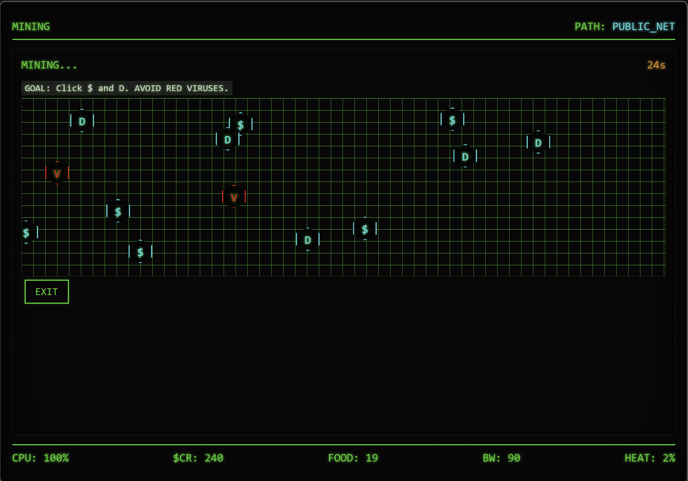
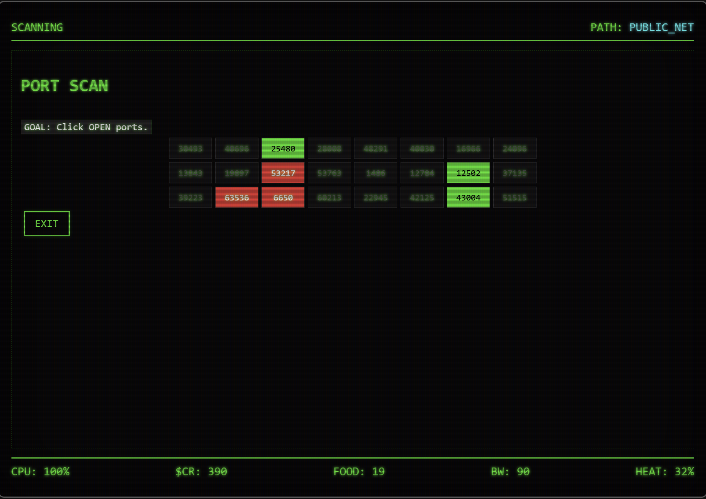
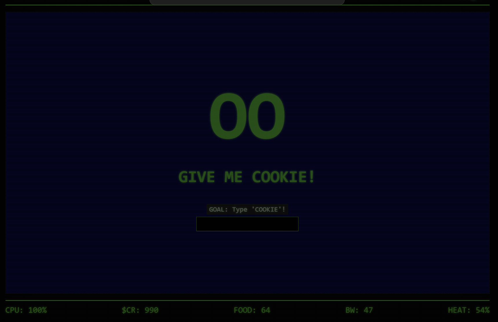
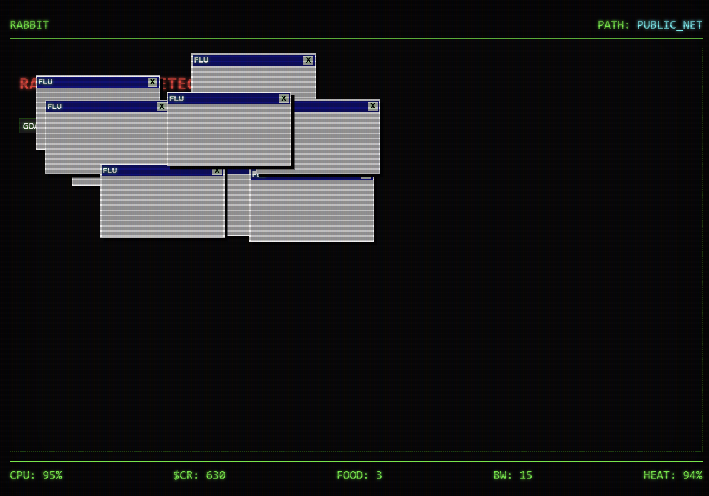

# Hacker Trail v2.8

A retro-styled hacking adventure inspired by the classic Oregon Trail. Navigate the sprawling net, manage your resources, and face off against the legendary Gibson.

## 🕹️ Gameplay

In **Hacker Trail**, you must "Jack In" and travel through various network nodes. Your goal is to reach the Gibson while managing your critical resources:

- 🟢 **CPU**: Your system health. If this hits 0%, you suffer a Kernel Panic.
- 💰 **Credits**: Currency for buying proxies, Jolt cola, and hardware.
- 🍔 **Food (Jolt)**: Keeps your energy up. Without it, your CPU degrades faster.
- 📡 **BW (Bandwidth)**: Necessary for data mining operations.
- 🔥 **Heat**: Your visibility to the feds. Reaching 100% results in being Busted.

## 🛠️ Minigames & Operations

### Data Mining
Mine for credits and food in the data stream. Be careful to avoid viruses!

### Port Scanning
Identify open ports to gain credits, but watch out for honeypots that increase your heat.

### Buffer Overflow (Hexing)
Pivot through systems by finding specific memory addresses in the hex stream.

## ⚠️ System Threats

### Cookie Monster
A persistent threat that demands "COOKIES" or it will devour your bandwidth.

### Rabbit Virus
Rapidly multiplying windows that can crash your CPU if not closed quickly.

## 🏆 Final Boss: The Gibson
Reach the end of the trail to attempt the ultimate hack. Navigate the Gibson's core memory in a Pac-Man style showdown to plant your worm and claim victory.

---
*“Mess with the best, die like the rest.”*
